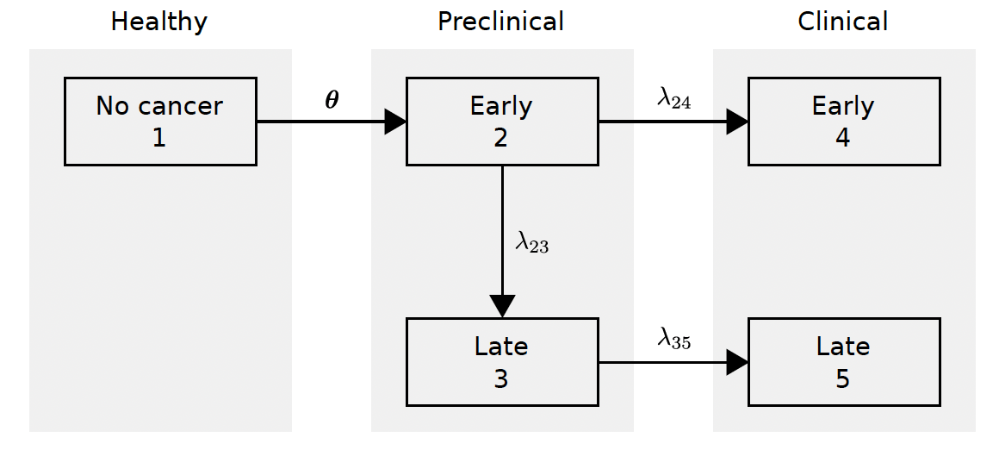

## Natural history figure
{#fig-model width="500"}


## Supplemental Figure: Simulated and observed incidence (control arm)
```{r, echo=FALSE, warning=FALSE, message=FALSE}
library(ggplot2)
library(reshape2)
library(patchwork)
library(gridExtra)
library(survminer)
library(here)
library(dplyr)
library(tidyr)
base_dir<- here("Data/NCRAS_fitted_data")


load_and_plot <- function(file_path, title, object_name,the_cancer_site,the_sex,all_control) {
  
  load(file_path)
  
  the_data <- get(object_name)[[1]]$outplot$data%>%mutate(Rate=value)
  
  the_data$Legend=the_data$variable
  the_data$Legend=factor(the_data$Legend,labels=c("Predicted rate","Observed rate"))
  
  all_control<-all_control %>% mutate(Rate=rate,midage=age,
                                      stage=ifelse(stage==1,"Early","Advanced"))%>%subset(cancer_site==the_cancer_site&sex==the_sex)

  all_control_mean<-all_control %>% group_by(sex,midage,stage) %>% summarise(Rate=mean(rate))%>%mutate(Legend="Mean Simulated rate",
                                                                                                       midage=as.numeric(as.character(midage)))
  the_data=bind_rows(all_control_mean, the_data)
  

   p1=ggplot(data=the_data,aes(x=midage,y=Rate))+geom_point(aes(color=Legend))+geom_line(aes(color=Legend,group=Legend))+
    facet_grid(~stage)+xlab("Age")+ylab("Rate/100,000")
   
 
  plot <- p1 + ggtitle(title) + theme_survminer() + ylab("Rate/100,000")+
    theme(plot.title = element_text(size = 10.5), legend.position = "bottom",
          axis.title.x = element_blank(),
          axis.title.y = element_blank(),
          strip.background =  element_blank(),
          #   strip.text.x =  element_blank(),
          line = element_line(size = 1)) + coord_cartesian(xlim=c(45,80))
  
  #+  
  #  scale_color_discrete(name = "Legend", labels = c("Model", "Observed")) +
  #  scale_linetype_discrete(name = "Legend", labels = c("Model", "Observed"))
  return(plot)
}


# Load and plot data for each cancer site

load(here(paste0("Data/combined_summary",1,".Rdata")))
male_anus_plot <- load_and_plot(file.path(base_dir, "anus_outfile_males.Rdata"), "Male Anus", "anusout_males","Anus","Male",all_control)
female_anus_plot <- load_and_plot(file.path(base_dir, "anus_outfile_females.Rdata"), "Female Anus", "anusout_females","Anus","Female",all_control)

male_bladder_plot <- load_and_plot(file.path(base_dir, "bladder_outfile_males.Rdata"), "Male Bladder","bladderout_males", "Bladder","Male",all_control)
female_bladder_plot <- load_and_plot(file.path(base_dir, "bladder_outfile_females.Rdata"), "Female Bladder","bladderout_females", "Bladder","Female",all_control)

male_colorectal_plot <- load_and_plot(file.path(base_dir, "colorectal_outfile_males.Rdata"), "Male colorectal","colorectalout_males", "Colorectal","Male",all_control)
female_colorectal_plot <- load_and_plot(file.path(base_dir, "colorectal_outfile_females.Rdata"), "Female colorectal","colorectalout_females", "Colorectal","Female",all_control)

male_lung_plot <- load_and_plot(file.path(base_dir, "lung_outfile_males.Rdata"), "Male Lung", "lungout_males","Lung","Male",all_control)
female_lung_plot <- load_and_plot(file.path(base_dir, "lung_outfile_females.Rdata"), "Female Lung", "lungout_females","Lung","Female",all_control)

male_esophagus_plot <- load_and_plot(file.path(base_dir, "esophagus_outfile_males.Rdata"), "Male esophagus", "esophagusout_males","Esophagus","Male",all_control)
female_esophagus_plot <- load_and_plot(file.path(base_dir, "esophagus_outfile_females.Rdata"), "Female esophagus", "esophagusout_females","Esophagus","Female",all_control)

male_stomach_plot <- load_and_plot(file.path(base_dir, "stomach_outfile_males.Rdata"), "Male stomach", "stomachout_males","Gastric","Male",all_control)
female_stomach_plot <- load_and_plot(file.path(base_dir, "stomach_outfile_females.Rdata"), "Female stomach", "stomachout_females","Gastric","Female",all_control)

male_headneck_plot <- load_and_plot(file.path(base_dir, "headneck_outfile_males.Rdata"), "Male headneck", "headneckout_males","Headandneck","Male",all_control)
female_headneck_plot <- load_and_plot(file.path(base_dir, "headneck_outfile_females.Rdata"), "Female headneck", "headneckout_females","Headandneck","Female",all_control)

male_liver_plot <- load_and_plot(file.path(base_dir, "liver_outfile_males.Rdata"), "Male liver", "liverout_males","Liver","Male",all_control)
female_liver_plot <- load_and_plot(file.path(base_dir, "liver_outfile_females.Rdata"), "Female liver", "liverout_females","Liver","Female",all_control)

male_lymphoma_plot <- load_and_plot(file.path(base_dir, "lymphoma_outfile_males.Rdata"), "Male lymphoma", "lymphomaout_males","Lymphoma","Male",all_control)
female_lymphoma_plot <- load_and_plot(file.path(base_dir, "lymphoma_outfile_females.Rdata"), "Female lymphoma", "lymphomaout_females","Lymphoma","Female",all_control)


female_ovary_plot <- load_and_plot(file.path(base_dir, "ovary_outfile_females.Rdata"), "Female ovary", "ovaryout_females","Ovary","Female",all_control)

male_pancreas_plot <- load_and_plot(file.path(base_dir, "pancreas_outfile_males.Rdata"), "Male pancreas", "pancreasout_males","Pancreas","Male",all_control)
female_pancreas_plot <- load_and_plot(file.path(base_dir, "pancreas_outfile_females.Rdata"), "Female pancreas", "pancreasout_females","Pancreas","Female",all_control)


  
```


```{r}
#| label: fig-male_incidence
#| fig-width: 18
#| fig-height: 10
#| echo: false
#| fig-cap: "Age-specific incidence of selected male cancers: observed (NCRAS), model-fitted, and simulated (averaged across 200 NHS-Galleri simulations)"
out=(male_anus_plot +   male_bladder_plot + 
       male_colorectal_plot + male_esophagus_plot + male_stomach_plot +
       male_headneck_plot + male_liver_plot + male_lung_plot + male_lymphoma_plot+
       male_pancreas_plot ) +
  plot_layout(ncol = 3, nrow = 5, guides = "collect") &
  theme(legend.position = "right")

ggsave(out,file=here("male_out.svg"),height=12, width=12)

out


```

```{r}
#| label: fig-female_incidence
#| fig-width: 18
#| fig-height: 12
#| echo: false
#| fig-cap: "Age-specific incidence of selected female cancers observed (NCRAS), model-fitted, and simulated (averaged across 200 NHS-Galleri simulations)"


 out=   (female_anus_plot +female_bladder_plot +  female_colorectal_plot+ 
       female_esophagus_plot + female_stomach_plot  +
       female_headneck_plot + female_liver_plot +female_lung_plot + female_lymphoma_plot+
       female_pancreas_plot +female_ovary_plot) +
  plot_layout(ncol = 3,  nrow = 5, guides = "collect") &
  theme(legend.position = "right")
 ggsave(out,file=here("female_out.svg"),height=12, width=12)

out


```


## Supplemental Table: Early to late transition rates
```{r}
#| echo: false
#| message: false
#| include: false
library(MCEDsim)
data("combined_fits_NHS")
the_cancer_sites=c("Anus",  "Bladder",  "Colorectal", "Esophagus",
                   "Headandneck", "Liver" , "Lung", "Lymphoma",
                   "Ovary",  "Pancreas", "Gastric")


get_rate_data_frame<-function(scenario_no,the_cancer_sites,constant_rate=0){
  
  if(scenario_no==1){
    the_OMST=1
    the_LMST=0.5          
  }
  
  if(scenario_no==2){
    the_OMST=2
    the_LMST=.5
  }
  
  if(scenario_no==3){
    the_OMST=2
    the_LMST=1
  }
  if(constant_rate==0){
    
    female_index=dplyr::filter(all_meta_data_female,OMST==the_OMST&LMST==the_LMST&cancer_site %in% the_cancer_sites)
    outfemale=data.frame(sex="Female", cancer_site=the_cancer_sites, early_late_rate=all_rates_female[13,14,female_index$index])
    
    male_index=dplyr::filter(all_meta_data_male,OMST==the_OMST&LMST==the_LMST&cancer_site %in% the_cancer_sites)
    outmale=data.frame(sex="Male",cancer_site=male_index$cancer_site, early_late_rate=all_rates_male[13,14,male_index$index])
  }else{
    outfemale=data.frame(sex="Female",cancer_site=the_cancer_sites, early_late_rate=constant_rate)
    outmale=data.frame(sex="Male",cancer_site=the_cancer_sites, early_late_rate=constant_rate)
  }
  out=rbind(outfemale,outmale)
  out$scenario_no=scenario_no
  return(out)
}

rates=bind_rows(get_rate_data_frame(scenario_no = 1, the_cancer_sites = the_cancer_sites,constant_rate = 0),
get_rate_data_frame(scenario_no = 2, the_cancer_sites = the_cancer_sites,constant_rate = 0),
get_rate_data_frame(scenario_no = 3, the_cancer_sites = the_cancer_sites,constant_rate = 0))

rates$mean_early=1/rates$early_late_rate

```


```{r}
#| echo: FALSE

rates_wide <- rates %>%
  pivot_wider(
    names_from = sex,
    values_from = c(early_late_rate, mean_early)
  )%>%select(c("scenario_no","cancer_site","early_late_rate_Female",	"early_late_rate_Male",	"mean_early_Female",	"mean_early_Male"))
knitr::kable(rates_wide,col.names = c("Natural history scenario",
    "Cancer Site",
    "Female Rate",
    "Male Rate",
    "Female Mean Early",
    "Male Mean Early"
  ),
digits=2)
```

Note: will want replace with calibrated model and sensitivity analysis scenario.

```{r}
#| echo: false
#| message: false
#| include: false


library(here)
library(ggplot2)
library(dplyr)
library(tidyr)
library(tidyverse)
library(patchwork)
library(survminer)

plot_theme<-function(){
  theme_survminer()+
    theme(plot.title = element_text(size = 10.5), legend.position = "bottom",
     #    axis.title.x = element_blank(),
    #      axis.title.y = element_blank(),
          strip.background =  element_blank(),
    #         strip.text.x =  element_blank(),
          line = element_line(size = 1))}


make_delay_plots2 <- function(extended_followup,the_early_to_late_rate,screen_arm_delay,the_scenario) {
  
  load(here("Data/all_delay_summary.Rdata"))
  combined_data<-combined_data%>%mutate(followup=as.numeric(as.character(followup)),
                                        scenario_no=factor(scenario_no))
  
  
  
  the_extended_followup=extended_followup
  the_screen_arm_delay=screen_arm_delay
  
  
  counts_summary <- subset(combined_data, followup <= 3) %>%
    group_by(seed, delay, scenario_no,extended_followup,early_to_late_rate,screen_arm_delay) %>%
    summarise(
      tot_late_control  = sum(tot_late_control),
      tot_late_screen   = sum(tot_late_screen),
      tot_late_interval = sum(tot_late_interval),
      tot_early_screen  = sum(tot_early_screen),
      tot_early_interval= sum(tot_early_interval),
      tot_early_control = sum(tot_early_control),
      .groups = "drop"
    )
  
  counts_summary_control_no_delay<-counts_summary%>%filter(delay==0)%>%select(c("seed","tot_late_control","tot_early_control","scenario_no","extended_followup","early_to_late_rate","screen_arm_delay"))%>%rename(ref_late_control=tot_late_control,ref_early_control=tot_early_control)
  

  
  
  counts_summary <- counts_summary %>%
    left_join(counts_summary_control_no_delay,by=c("seed","scenario_no","early_to_late_rate","extended_followup","screen_arm_delay"))
  
  counts_summary<-counts_summary%>%
    group_by(delay,scenario_no,extended_followup,early_to_late_rate,screen_arm_delay) %>%
    summarise(
      n = n(),
      mean_late_control = mean(tot_late_control),
      se_late_control   = sd(tot_late_control)/sqrt(n),
      
      mean_early_control = mean(tot_early_control),
      se_early_control   = sd(tot_early_control)/sqrt(n),
      
      mean_late_screen = mean(tot_late_screen),
      se_late_screen   = sd(tot_late_screen)/sqrt(n),
      
      mean_late_interval = mean(tot_late_interval),
      se_late_interval   = sd(tot_late_interval)/sqrt(n),
      
      mean_late_screen_arm = mean(tot_late_screen + tot_late_interval),
      se_late_screen_arm   = sd(tot_late_screen + tot_late_interval)/sqrt(n),
      
      mean_early_screen = mean(tot_early_screen),
      se_early_screen   = sd(tot_early_screen)/sqrt(n),
      
      mean_early_interval = mean(tot_early_interval),
      se_early_interval   = sd(tot_early_interval)/sqrt(n),
      
      mean_early_screen_arm = mean(tot_early_screen + tot_early_interval),
      se_early_screen_arm   = sd(tot_early_screen + tot_early_interval)/sqrt(n),
      
      mean_all_control = mean(tot_early_control + tot_late_control),
      se_all_control   = sd(tot_early_control + tot_late_control)/sqrt(n),
      
      mean_all_screen = mean(tot_early_screen + tot_late_screen),
      se_all_screen   = sd(tot_early_screen + tot_late_screen)/sqrt(n),
      
      mean_all_interval = mean(tot_early_interval + tot_late_interval),
      se_all_interval   = sd(tot_early_interval + tot_late_interval)/sqrt(n),
      
      mean_all_screen_arm = mean(tot_early_screen + tot_early_interval + tot_late_screen + tot_late_interval),
      se_all_screen_arm   = sd(tot_early_screen + tot_early_interval + tot_late_screen + tot_late_interval)/sqrt(n),
      
      mean_reduction = mean(tot_late_control - (tot_late_screen + tot_late_interval)),
      se_reduction   = sd(tot_late_control - (tot_late_screen + tot_late_interval))/sqrt(n),
      
      mean_policy_reduction = mean(ref_late_control - (tot_late_screen + tot_late_interval)),
      se_policy_reduction   = sd(ref_late_control - (tot_late_screen + tot_late_interval))/sqrt(n),
      
      mean_rel_reduction = 100*mean((tot_late_control - (tot_late_screen + tot_late_interval))/tot_late_control),
      se_rel_reduction   = 100*sd((tot_late_control - (tot_late_screen + tot_late_interval))/tot_late_control)/sqrt(n),
      
      mean_policy_rel_reduction = 100*mean((ref_late_control - (tot_late_screen + tot_late_interval))/ref_late_control),
      se_policy_rel_reduction   = 100*sd((ref_late_control - (tot_late_screen + tot_late_interval))/ref_late_control)/sqrt(n),
      .groups = "drop"
    )
  

  
  counts_long <- counts_summary %>%
    pivot_longer(
      cols = -c(delay,early_to_late_rate,extended_followup,scenario_no,screen_arm_delay),
      names_to = c(".value", "variable"),
      names_pattern = "(mean|se)_(.*)"
    )%>%mutate(early_to_late_rate=factor(early_to_late_rate))
  
  counts_only=subset(counts_long,!variable%in%c("reduction","ratio","rel_reduction"))%>%
    mutate(stage= case_when(grepl("^early_", variable) ~ "early",
                            grepl("^late_",  variable)  ~ "late",
                            grepl("^all_",  variable)  ~ "all",
                            TRUE ~ NA_character_),
           arm = case_when(
             grepl("(_screen$|_screen_arm$|_interval$)", variable) ~ "screen",
             TRUE ~ "control"),
           mode=case_when(
             grepl("(_screen_arm)" ,variable)~"total",
             grepl("(_screen)", variable) ~ "screen",
             grepl("(_control|_interval)", variable) ~ "clinical",
             TRUE ~ "control"))%>%mutate(
               stage = factor(stage, levels = c("early", "late", "all")),
               arm   = factor(arm,   levels = c("control", "screen")),
               mode  = factor(mode,  levels = c("clinical", "screen", "total"))
             )%>%subset(!is.na(variable))%>%
    mutate(early_to_late_rate=factor(early_to_late_rate))
  
  counts_only<-counts_only %>% subset(scenario_no==the_scenario)
  
  theme_mced <- function(){
    theme_survminer()+
      theme(plot.title = element_text(size = 10.5), legend.position = "bottom",
            axis.title.x = element_blank(),
            axis.title.y = element_blank(),
            strip.background =  element_blank(),
               strip.text.x =  element_blank(),
            line = element_line(size = 1))}
  
  
  
  
  bias_data<-subset(counts_long,(variable%in%c("rel_reduction","reduction")&extended_followup==the_extended_followup)&(early_to_late_rate==the_early_to_late_rate&screen_arm_delay==the_screen_arm_delay))
  
  delay0 <- bias_data %>%
    filter(delay == 0) %>%
    select(
      scenario_no,
      extended_followup,
      early_to_late_rate,
      screen_arm_delay,
      variable,
      mean_delay0 = mean,
      se_delay0 = se
    )
  
  results_bias <- bias_data %>%
    left_join(
      delay0,
      by = c(
        "scenario_no",
        "extended_followup",
        "early_to_late_rate",
        "screen_arm_delay",
        "variable"
      )
    ) %>%
    mutate(
      abs_bias = mean - mean_delay0,
      rel_bias = abs_bias / mean_delay0,
      pct_bias = 100 * rel_bias
    )
  
  
  #Plots of counts of outcomes
  counts_plot <- ggplot(data=subset(counts_only,(!is.na(mode)&extended_followup==the_extended_followup)&(early_to_late_rate==the_early_to_late_rate&screen_arm_delay==the_screen_arm_delay)),aes(x = delay, y = mean, group = stage)) +
    #  geom_ribbon(aes(ymin = mean - 1.96*se, ymax = mean + 1.96*se, fill = stage),alpha = .18) +
    geom_line(aes(color = stage,group=interaction(scenario_no,stage))) +geom_point(aes(color = stage)) +facet_grid(arm ~ mode) +
    plot_theme() +
    labs(x = "Diagnosis delay (years)", y = "Mean count", color = "Stage")+
    ggtitle("Stage-specific cancer diagnoses by trial arm and mode of detection")
  
  
  #Plots of relative reduction in late stage disease
  plot_rel_reduction <- ggplot(subset(counts_long,
                                      ((variable=="rel_reduction"&extended_followup==the_extended_followup)&(early_to_late_rate==the_early_to_late_rate&screen_arm_delay==the_screen_arm_delay))), aes(delay, mean)) +
    geom_line(linewidth = 1,aes(color=scenario_no,group=scenario_no)) +
    geom_point(size = 2,aes(color=scenario_no)) +
    #    geom_errorbar(aes(ymin=mean-se,ymax=mean+se),alpha=.18)+
    theme_mced() +
    coord_cartesian(xlim=c(0,.5),ylim=c(-15,25))+
    labs(x = "Diagnosis delay (years)", y = "Relative reduction (%)")
  
  plot_abs_reduction <- ggplot(subset(counts_long,(variable=="reduction"&extended_followup==the_extended_followup)&(early_to_late_rate==the_early_to_late_rate&screen_arm_delay==the_screen_arm_delay)), aes(delay, mean)) +
    geom_line(linewidth = 1,aes(color=scenario_no,group=scenario_no)) +
    geom_point(size = 2,aes(color=scenario_no)) +
    #  geom_errorbar(aes(ymin=mean-se,ymax=mean+se),alpha=.18)+
    theme_mced() +
    labs(x = "Diagnosis delay (years)", y = "Absolute reduction (cases)")
  
  
  plot_pct_bias_rel_reduction <- ggplot(subset(results_bias,variable=="rel_reduction"), aes(delay, pct_bias)) +
    geom_line(linewidth = 1,aes(color=scenario_no,group=scenario_no)) +
    geom_point(size = 2,aes(color=scenario_no)) +
    coord_cartesian(xlim=c(0,.5),ylim=c(-350,15))+
    # geom_errorbar(aes(ymin=mean-se,ymax=mean+se),alpha=.18)+
    theme_mced() +
    labs(x = "Diagnosis delay (years)", y = "Percent Bias in trial outcome")
  
  plot_abs_bias_rel_reduction <- ggplot(subset(results_bias,variable=="rel_reduction"), aes(delay, abs_bias)) +
    geom_line(linewidth = 1,aes(color=scenario_no,group=scenario_no)) +
    geom_point(size = 2,aes(color=scenario_no)) +
    coord_cartesian(xlim=c(0,.5),ylim=c(-30,5))+
    # geom_errorbar(aes(ymin=mean-se,ymax=mean+se),alpha=.18)+
    theme_mced() +
    labs(x = "Diagnosis delay (years)", y = "Absolute bias in trial outcome")
  
  
  plot_pct_bias_abs_reduction <- ggplot(subset(results_bias,variable=="reduction"), aes(delay, pct_bias)) +
    geom_line(linewidth = 1,aes(color=scenario_no,group=scenario_no)) +
    geom_point(size = 2,aes(color=scenario_no)) +
    # geom_errorbar(aes(ymin=mean-se,ymax=mean+se),alpha=.18)+
    theme_mced() +
    labs(x = "Diagnosis delay (years)", y = "Percent Bias in trial outcome")
  
  plot_abs_bias_abs_reduction <- ggplot(subset(results_bias,variable=="reduction"), aes(delay, abs_bias)) +
    geom_line(linewidth = 1,aes(color=scenario_no,group=scenario_no)) +
    geom_point(size = 2,aes(color=scenario_no)) +
    # geom_errorbar(aes(ymin=mean-se,ymax=mean+se),alpha=.18)+
    theme_mced() +
    labs(x = "Diagnosis delay (years)", y = "Absolute bias in trial outcome")
  
  

  #Plots of relative reduction in late stage disease
  plot_rel_policy <- ggplot(subset(counts_summary,(extended_followup==the_extended_followup)&(early_to_late_rate==the_early_to_late_rate &screen_arm_delay==the_screen_arm_delay)), aes(delay, mean_policy_rel_reduction)) +
    geom_line(linewidth = 1,aes(color=scenario_no,group=scenario_no)) +
    geom_point(size = 2,aes(color=scenario_no)) +
  #  geom_errorbar(aes(ymin=mean-se,ymax=mean+se),alpha=.18)+
    theme_mced() +
    labs(x = "Diagnosis delay (years)", y = "Relative reduction (%)")
  
  plot_abs_policy <- ggplot(subset(counts_summary,(extended_followup==the_extended_followup)&(early_to_late_rate==the_early_to_late_rate&screen_arm_delay==the_screen_arm_delay)), aes(delay, mean_policy_reduction)) +
    geom_line(linewidth = 1,aes(color=scenario_no,group=scenario_no)) +
    geom_point(size = 2,aes(color=scenario_no)) +
  #  geom_errorbar(aes(ymin=mean-se,ymax=mean+se),alpha=.18)+
    theme_mced() +
    labs(x = "Diagnosis delay (years)", y = "Absolute reduction (cases)")
  
  reduction_plot<-plot_abs_reduction+ plot_theme()+ggtitle("Absolute")+
    plot_rel_reduction+ plot_theme()+ggtitle("Relative") +plot_layout(guides = 'collect')+ plot_annotation(title = 'Reductions in late-stage disease by delay') & theme(legend.position="bottom")
  
  
  policy_plot<-plot_abs_policy+ggtitle("Absolute")+plot_rel_policy+ggtitle("Relative") +
   plot_layout(guides = 'collect')+
    plot_annotation(title = 'Reductions in late-stage disease by delay')&theme(legend.position="bottom")
  
  bias_plot_rel<-   plot_abs_bias_rel_reduction +ggtitle("Absolute bias") + plot_theme()+
    plot_pct_bias_rel_reduction+ plot_theme()+ggtitle("Percent bias")+
    plot_layout(guides="collect")&theme(legend.position = "bottom")
  
  bias_plot_abs<-   plot_abs_bias_abs_reduction+ggtitle("Absolute bias") + 
    plot_pct_bias_abs_reduction+ggtitle("Percent bias")+plot_layout(guides="collect")&theme(legend.position="bottom")
  
  
  combined_plot=plot_rel_reduction+plot_theme()+ggtitle("Trial endpoint")+
    plot_abs_bias_rel_reduction +ggtitle("Absolute bias") + 
    plot_pct_bias_rel_reduction+ggtitle("Percent bias")+plot_layout(guides="collect")&theme(legend.position = "bottom")
  
  
  
  
  return(list(
    counts_plot = counts_plot,
    reduction_plot = reduction_plot,
    policy_plot=policy_plot,
    bias_plot_rel=bias_plot_rel,
    bias_plot_abs=bias_plot_abs,
    combined_plot=combined_plot,
    plot_rel_reduction=plot_rel_reduction,
    plot_abs_bias_rel_reduction=plot_abs_bias_rel_reduction,
    plot_pct_bias_rel_reduction=plot_pct_bias_rel_reduction
  ))
}


#no screen arm delay
# 3-year window
plots_3yr_C_0 <- make_delay_plots2(extended_followup=0,the_early_to_late_rate=0,screen_arm_delay=0,the_scenario=1)

# extended follow-up
plots_ext_C_0 <- make_delay_plots2(extended_followup=1,the_early_to_late_rate=0,screen_arm_delay=0,the_scenario=1)

#screen arm delay
# 3-year window
plots_3yr_C_1 <- make_delay_plots2(extended_followup=0,the_early_to_late_rate=0,screen_arm_delay=1,the_scenario=1)

# extended follow-up
plots_ext_C_1 <- make_delay_plots2(extended_followup=1,the_early_to_late_rate=0,screen_arm_delay=1,the_scenario=1)


```

## Figure: Overall trial outcomes--counts of screen- and interval-detected cases within the trial by study arm (censoring at end of trial; screen and clinical cancers)   

```{r}
#| label: fig-counts
#| echo: false
#| message: false
#| fig-height: 6
#| fig-width: 7
#| fig-cap: "Mean counts across of simulations of cases detected by screen and control arm during simulated NHS-Galleri trials by diagnosis delay"


plots_3yr_C_1$counts_plot
ggsave(plots_3yr_C_1$counts_plot,file=here("plot_3yr_counts.svg"),height=7,width=8)

```
## Figure: Overall trial outcomes--counts of screen- and interval-detected cases within the trial by study arm (censoring at end of trial; clinical cancers only)   

```{r}
#| label: fig-counts_control
#| echo: false
#| message: false
#| fig-height: 6
#| fig-width: 7
#| fig-cap: "Mean counts across of simulations of cases detected by screen and control arm during simulated NHS-Galleri trials by diagnosis delay"

plots_3yr_C_0$counts_plot
ggsave(plots_3yr_C_0$counts_plot,file=here("plot_3yr_counts_control.svg"),height=7,width=8)

```


## Figure: Absolute and relative reduction in late stage disease  (censoring at end of trial;screen and clinical cancers)
```{r}
#| label: fig-trial_reduction
#| echo: false
#| message: false
#| fig-height: 6
#| fig-width: 7
#| fig-cap: "Mean counts across of simulations of cases detected by screen and control arm during simulated NHS-Galleri trials by diagnosis delay"

plots_3yr_C_1$reduction_plot

ggsave(plots_3yr_C_1$reduction_plot,file=here("plot_3yr_reduction.svg"),height=4,width=6)
```

## Figure: Absolute and relative reduction in late stage disease  (censoring at end of trial; clinical cancer only)


```{r}
#| label: fig-trial_reduction_control
#| echo: false
#| message: false
#| fig-height: 6
#| fig-width: 7
#| fig-cap: "Mean counts across of simulations of cases detected by screen and control arm during simulated NHS-Galleri trials by diagnosis delay"

plots_3yr_C_0$reduction_plot

ggsave(plots_3yr_C_0$reduction_plot,file=here("plot_3yr_reduction_control.svg"),height=4,width=6)
```


## Figure: Absolute and relative bias in late-stage outcomes (censoring at end of trial; screen and clinical cancer only)  
```{r}
#| label: fig-trial_bias
#| echo: false
#| message: false
#| fig-height: 6
#| fig-width: 7
#| fig-cap: "Absolute and percent bias in primary trial outcome (relative reduction in late stage disease) "

plots_3yr_C_1$bias_plot_rel
ggsave(plots_3yr_C_1$bias_plot_rel,file=here("plot_3yr_bias.svg"),height=4,width=6)

```


## Figure: Absolute and relative bias in late-stage outcomes (censoring at end of trial; clinical cancer only)  
```{r}
#| label: fig-trial_bias_control
#| echo: false
#| message: false
#| fig-height: 6
#| fig-width: 7
#| fig-cap: "Absolute and percent bias in primary trial outcome (relative reduction in late stage disease) "

plots_3yr_C_0$bias_plot_rel
ggsave(plots_3yr_C_0$bias_plot_rel,file=here("plot_3yr_bias.svg"),height=4,width=6)

```


## Figure: Observed trial endpoints and absolute and relative bias given diagnostic delay (censoring by end of the trial; screen and clinical cancers)
```{r}
#| label: fig-combined_endpoint
#| echo: false
#| message: false
#| fig-height: 6
#| fig-width: 7
#| fig-cap: "Absolute and percent bias in primary trial outcome (relative reduction in late stage disease) "

plots_3yr_C_1$combined_plot
ggsave(plots_3yr_C_1$combined_plot,file=here("plot_3yr_combined.svg"),height=4,width=9)

```

## Figure: Observed trial endpoints and absolute and relative bias given diagnostic delay (censoring by end of the trial; clinical cancer only)
```{r}
#| label: fig-combined_endpoint_control
#| echo: false
#| message: false
#| fig-height: 6
#| fig-width: 7
#| fig-cap: "Absolute and percent bias in primary trial outcome (relative reduction in late stage disease) "

plots_3yr_C_0$combined_plot
ggsave(plots_3yr_C_0$combined_plot,file=here("plot_3yr_combined_control.svg"),height=4,width=9)

```


## Figure: Overall trial outcomes--counts of screen- and interval-detected cases within the trial by study arm (continued follow-up; clinical and screen cancers)   

```{r}
#| label: fig-counts_ext
#| echo: false
#| message: false
#| fig-height: 6
#| fig-width: 7
#| fig-cap: "Mean counts across of simulations of cases detected by screen and control arm during simulated NHS-Galleri trials by diagnosis delay"


plots_ext_C_1$counts_plot
ggsave(plots_ext_C_1$counts_plot,file=here("plot_ext_counts.svg"),height=7,width=8)

```

## Figure: Overall trial outcomes--counts of screen- and interval-detected cases within the trial by study arm (continued follow-up; clinical cancers only)   

```{r}
#| label: fig-counts_ext_control
#| echo: false
#| message: false
#| fig-height: 6
#| fig-width: 7
#| fig-cap: "Mean counts across of simulations of cases detected by screen and control arm during simulated NHS-Galleri trials by diagnosis delay"


plots_ext_C_0$counts_plot
ggsave(plots_ext_C_0$counts_plot,file=here("plot_ext_counts_control.svg"),height=7,width=8)

```


## Figure: Absolute and relative reduction in late stage disease  (continued follow-up; screen and clinical cancers)


```{r}
#| label: fig-trial_reduction_ext
#| echo: false
#| message: false
#| fig-height: 6
#| fig-width: 7
#| fig-cap: "Mean counts across of simulations of cases detected by screen and control arm during simulated NHS-Galleri trials by diagnosis delay"

plots_ext_C_1$reduction_plot
ggsave(plots_ext_C_1$reduction_plot,file=here("plot_ext_reduction.svg"),height=4,width=6)

```

## Figure: Absolute and relative reduction in late stage disease  (continued follow-up; clinical cancers)


```{r}
#| label: fig-trial_reduction_ext_control
#| echo: false
#| message: false
#| fig-height: 6
#| fig-width: 7
#| fig-cap: "Mean counts across of simulations of cases detected by screen and control arm during simulated NHS-Galleri trials by diagnosis delay"

plots_ext_C_0$reduction_plot
ggsave(plots_ext_C_0$reduction_plot,file=here("plot_ext_reduction_control.svg"),height=4,width=6)

```


## Figure: Absolute and relative bias in late-stage outcomes (continued follow-up; screen and clinical cancers)  
```{r}
#| label: fig-trial_bias_ext
#| echo: false
#| message: false
#| fig-height: 6
#| fig-width: 7
#| fig-cap: "Absolute and percent bias in primary trial outcome (relative reduction in late stage disease) "

plots_ext_C_1$bias_plot_rel
ggsave(plots_ext_C_1$bias_plot_rel,file=here("plot_ext_bias.svg"),height=4,width=6)

```


## Figure: Absolute and relative bias in late-stage outcomes (continued follow-up; clinical cancers)  
```{r}
#| label: fig-trial_bias_ext_control
#| echo: false
#| message: false
#| fig-height: 6
#| fig-width: 7
#| fig-cap: "Absolute and percent bias in primary trial outcome (relative reduction in late stage disease) "

plots_ext_C_0$bias_plot_rel
ggsave(plots_ext_C_0$bias_plot_rel,file=here("plot_ext_bias_control.svg"),height=4,width=6)

```


## Figure: Observed trial endpoints and absolute and relative bias given diagnostic delay (continued follow-up; clinical and screen detected cases)
```{r}
#| label: fig-combined_endpoint_ext
#| echo: false
#| message: false
#| fig-height: 6
#| fig-width: 7
#| fig-cap: "Absolute and percent bias in primary trial outcome (relative reduction in late stage disease) "

plots_ext_C_1$combined_plot
ggsave(plots_ext_C_1$combined_plot,file=here("plot_ext_combined.svg"),height=4,width=9)

```

## Figure: Observed trial endpoints and absolute and relative bias given diagnostic delay (continued follow-up; clinical and screen detected cases)
```{r}
#| label: fig-combined_endpoint_ext_control
#| echo: false
#| message: false
#| fig-height: 6
#| fig-width: 7
#| fig-cap: "Absolute and percent bias in primary trial outcome (relative reduction in late stage disease) "

plots_ext_C_0$combined_plot
ggsave(plots_ext_C_0$combined_plot,file=here("plot_ext_combined_control.svg"),height=4,width=9)

```

## Figure: Observed trial endpoints and absolute and relative bias given diagnostic delay (continued follow-up; control arm)--end of trial and extended followup combined
```{r}
#| label: fig-combined_endpoint_all
#| echo: false
#| message: false
#| fig-height: 12
#| fig-width: 7
#| fig-cap: "Absolute and percent bias in primary trial outcome (relative reduction in late stage disease) "


library(grid)

heading1 <- wrap_elements(
  full = textGrob("End of trial", gp = gpar(fontface = "bold", fontsize = 12))
)

heading2 <- wrap_elements(
  full = textGrob("Continued follow-up", gp = gpar(fontface = "bold", fontsize = 12))
)

row1 <- (
  plots_3yr_C_1$plot_rel_reduction + plot_theme() + ggtitle("Trial endpoint\n(Percent reduction in late-stage disease)") |
  plots_3yr_C_1$plot_abs_bias_rel_reduction + ggtitle("Absolute bias") |
  plots_3yr_C_1$plot_pct_bias_rel_reduction + ggtitle("Percent bias")
)

row2 <- (
  plots_ext_C_1$plot_rel_reduction + plot_theme() + ggtitle("Trial endpoint\n(Percent reduction in late-stage disease)") |
  plots_ext_C_1$plot_abs_bias_rel_reduction + ggtitle("Absolute bias") |
  plots_ext_C_1$plot_pct_bias_rel_reduction + ggtitle("Percent bias")
)

combined_plot <- (
  heading1 /
  row1 /
  heading2 /
  row2
) +
  plot_layout(
    heights = c(0.08, 1, 0.08, 1),
    guides = "collect"
  ) &
  theme(legend.position = "bottom")

ggsave(combined_plot,file=here("plot_all_combined.svg"),height=8,width=9)
```


## Figure: Observed trial endpoints and absolute and relative bias given diagnostic delay (continued follow-up; control arm)--end of trial and extended followup combined
```{r}
#| label: fig-combined_endpoint_control_all
#| echo: false
#| message: false
#| fig-height: 12
#| fig-width: 7
#| fig-cap: "Absolute and percent bias in primary trial outcome (relative reduction in late stage disease) "


library(grid)

heading1 <- wrap_elements(
  full = textGrob("End of trial", gp = gpar(fontface = "bold", fontsize = 12))
)

heading2 <- wrap_elements(
  full = textGrob("Continued follow-up", gp = gpar(fontface = "bold", fontsize = 12))
)

row1 <- (
  plots_3yr_C_0$plot_rel_reduction + plot_theme() + ggtitle("Trial endpoint\n(Percent reduction in late-stage disease)") |
  plots_3yr_C_0$plot_abs_bias_rel_reduction + ggtitle("Absolute bias") |
  plots_3yr_C_0$plot_pct_bias_rel_reduction + ggtitle("Percent bias")
)

row2 <- (
  plots_ext_C_0$plot_rel_reduction + plot_theme() + ggtitle("Trial endpoint\n(Percent reduction in late-stage disease)") |
  plots_ext_C_0$plot_abs_bias_rel_reduction + ggtitle("Absolute bias") |
  plots_ext_C_0$plot_pct_bias_rel_reduction + ggtitle("Percent bias")
)

combined_plot <- (
  heading1 /
  row1 /
  heading2 /
  row2
) +
  plot_layout(
    heights = c(0.08, 1, 0.08, 1),
    guides = "collect"
  ) &
  theme(legend.position = "bottom")

ggsave(combined_plot,file=here("plot_all_combined_control.svg"),height=8,width=9)
```

## Figure: Policy-relevant comparisons given diagnostic delay--continued follow-up (screen and clinical cases affected) 
```{r}
#| label: fig-policy_ext
#| echo: false
#| message: false
#| fig-height: 6
#| fig-width: 7
#| fig-cap: "Absolute and percent bias in primary trial outcome (relative reduction in late stage disease) "

plots_ext_C_1$policy_plot
ggsave(plots_ext_C_1$policy_plot,file=here("plot_ext_policy.svg"),height=4,width=6)

```

## Figure: Policy-relevant comparisons given diagnostic delay--continued follow-up (clinical cases only)
```{r}
#| label: fig-policy_ext_control
#| echo: false
#| message: false
#| fig-height: 6
#| fig-width: 7
#| fig-cap: "Absolute and percent bias in primary trial outcome (relative reduction in late stage disease) "

plots_ext_C_0$policy_plot
ggsave(plots_ext_C_0$policy_plot,file=here("plot_ext_policy_control.svg"),height=4,width=6)
```


```{r}
#| label: fig-policy_reduction_extended_followup
#| echo: false
#| message: false
#| fig-height: 10
#| fig-width: 12 
#| fig-cap: "**Extended follow-up** Mean absolute and relative reductions in late-stage disease between control arm with no delay and screen arm given diagnostic delay applied to I. clinical cases only II. screen and clinical cases."

heading_plot <- function(label) {
  ggplot() +
    annotate("text", x = 0, y = 0.5, label = label,
             hjust = 0, vjust = 0.5,
             fontface = "bold", size = 5) +
    xlim(0, 1) + ylim(0, 1) +
    theme_void() +
    theme(plot.margin = margin(5, 0, 2, 0))
}

scenario_I <- wrap_elements(
  heading_plot("Scenario I") /
    wrap_elements(plots_ext_C_0$policy_plot) +
    plot_layout(heights = c(0.06, 1))
)

scenario_II <- wrap_elements(
  heading_plot("Scenario II") /
    wrap_elements(plots_ext_C_1$policy_plot) +
    plot_layout(heights = c(0.06, 1))
)


scenario_I + scenario_II 


```


## Figure: Calibration of NHS Galleri
```{r}
#| label: NHS_Galleri_calibration
#| echo: false
#| message: false
#| fig-height: 5
#| fig-width: 8
#| fig-cap: "Calibration of model to NHS Galleri trial data "

calibration=read.csv(here("Tables/calibration.csv"))

  
method_A=ggplot(data=subset(calibration,cal_method=="A"),aes(x=OMST,y=early_alpha))+
  geom_point(aes(color=deviation))+scale_color_gradient(low = "blue", high = "green")
method_B=ggplot(data=subset(calibration,cal_method=="B"),aes(x=OMST,y=early_alpha))+
  geom_point(aes(color=deviation))+scale_color_gradient(low = "blue", high = "green")+ylab("Early-stage sens. decrement (%)")

out=method_B+ggtitle("OMST by early-stage sensitivity decrement\nfor top 20 calibrated models")+plot_theme()
ggsave(out,file=here("plot_correlation.svg"),height=4,width=4)

```


